# Предсказание стоимости аренды жилья по объявлению
Итоговый проект

---

## 1. Введение и постановка задачи

**Задача** По параметрам объявления об аренде квартиры предсказать месячную
арендную плату. Это регрессия, таргет — число, цена в долларах.

**Зачем это нужно** Автоматическая оценка цены — базовая функция любой площадки
с недвижимостью. Арендодателю она помогает выставить адекватную цену, а
арендатору — понять, не переплачивает ли он. Отдельно такая модель полезна
самой площадке... по ней можно находить подозрительно дешёвые объявления
(скорее всего, мошенничество) и завышенные, которые будут висеть месяцами.

**Метрика качества — MAE (средняя абсолютная ошибка) в долларах**

1. Её легко объяснить. MAE = 160 $ значит буквально: «модель в среднем
   ошибается на 160 долларов в месяц». Не нужно объяснять, что такое квадрат
   ошибки.
2. Она устойчива к выбросам. Распределение цены сильно скошено вправо: медиана
   1350 $, а максимум 52 500 $. RMSE в такой ситуации определяется несколькими
   самыми дорогими объявлениями, а не типичным качеством.
3. Она соответствует задаче. Ошибка в 200 $ одинаково неприятна для
   пользователя и на квартире за 1000 $, и на квартире за 1200 $ —
   линейный штраф тут честнее квадратичного.

Дополнительно считаю RMSE (разрыв с MAE показывает, часто ли модель
допускает крупные промахи), MAPE (относительная ошибка, чтобы сравнивать
дешёвый и дорогой сегменты) и R² (для сравнения с чужими работами).

Если метрики противоречат друг другу, приоритет у MAE — финальную модель
выбираю по ней.

---

## 2. Поиск и описание данных

**Источник** [Apartment for Rent Classified](https://archive.ics.uci.edu/dataset/555/apartment+for+rent+classified),
UCI Machine Learning Repository

**Почему этот датасет** Нужна была задача с понятной бизнес-постановкой и
достаточно «сырыми» данными. Объявления с классифайдов подходят идеально...
там есть мультиселекты, свободный текст, география и несогласованные единицы
измерения

**Что внутри:**

| | |
|---|---|
| Объявлений | 99 492 |
| Колонок | 22 (21 признак + таргет `price`) |
| Период | декабрь 2018 — декабрь 2019 |
| География | США, 51 штат, 2 979 городов |
| Таргет | `price` — месячная арендная плата, $ |

Колонки: площадь (`square_feet`), число спален и санузлов, координаты, город и
штат, мультиселект удобств (`amenities`), разрешённые питомцы, наличие фото,
заголовок и текст объявления, площадка-источник, время публикации.

Данные в репозиторий не коммитил — они весят около 100 МБ. Вместо этого в
`src/data/load.py` лежит код, который скачивает и распаковывает их с UCI.

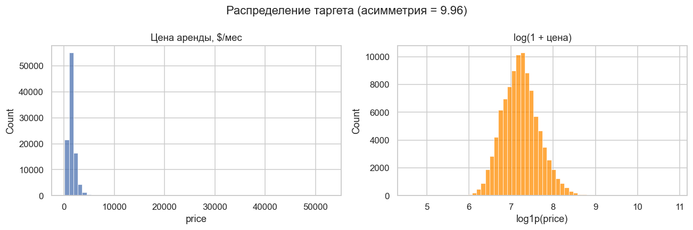

Распределение сильно скошено вправо, асимметрия 9.96. Логарифм выпрямляет его
почти до нормального — отсюда позже появилась гипотеза про обучение на
`log(price)`.

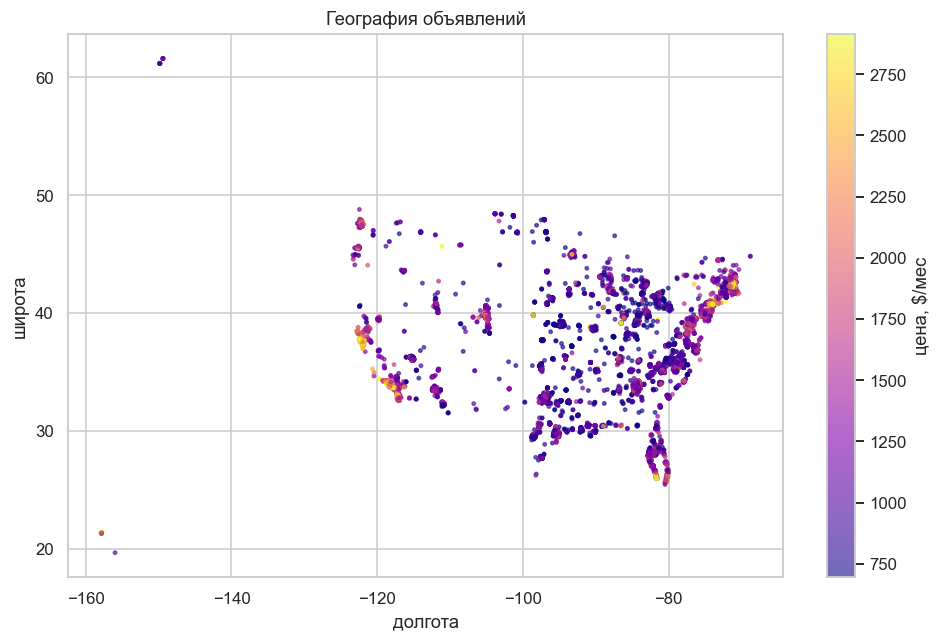

По карте видно главное: цена определяется прежде всего географией. Разброс
медианных цен между штатами — в разы.

---

## 3. Обработка и подготовка данных

### Пропуски

Пропуски в файле записаны словом `null`, а не пустым значением. Если этого не
учесть при чтении, pandas прочитает их как обычный текст, и, например,
`bathrooms` останется колонкой типа `object`.

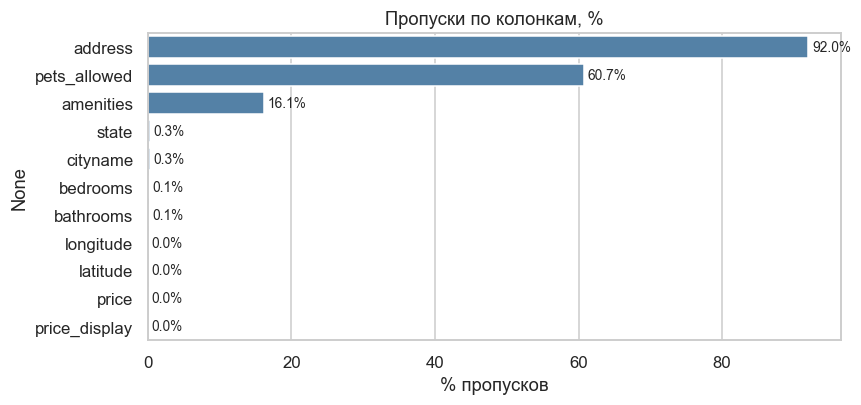

Решения по колонкам:

| Колонка | Пропусков | Что сделал |
|---|---|---|
| `address` | 92% | удалил: география уже есть в координатах и городе |
| `pets_allowed` | 61% | заполнил пустой строкой |
| `amenities` | 16% | заполнил пустой строкой |
| `cityname`, `state`, координаты | 0.3% | удалил строки |
| `bathrooms`, `bedrooms` | 0.1% | заполнил медианой |
| `price` | 1 строка | удалил |

Про `pets_allowed` и `amenities` отдельно: это не потерянные данные. Оба
поля заполняются галочками при подаче объявления, и пустое значение означает
«ничего не отметили». Поэтому я заполнил их пустой строкой и завёл отдельный
флаг `pets_not_specified` — само отсутствие информации может быть сигналом.

### Дубликаты

Полных дублей строк — 84. Но если сравнивать по набору «координаты + площадь +
спальни + санузлы», совпадает уже около трети строк: это повторные подачи
одного и того же объекта. Это важно для сплита, про него ниже.

### Единицы измерения

Нашёл 4 объявления, где цена указана за неделю, а не за месяц (`price_type`
равен `Weekly` или `Monthly|Weekly`). Их всего четыре из 99 тысяч, но если не
заметить, они превратятся в «аномально дешёвые квартиры» и будут отброшены как
ошибки ввода. Пересчитал в месячные, умножив на 52/12.

### Выбросы

Отсёк цены вне диапазона 200–10 000 $ и площади вне 100–6 000 кв. футов.

Не стал использовать правило IQR или трёх сигм: оба рассчитаны на
симметричное распределение, а здесь тяжёлый правый хвост, и они отрезали бы
вполне реальные дорогие квартиры.

Всего очистка убрала 0.47% строк — осталось 99 025.

### Генерация признаков

Из 21 исходной колонки пригодных «как есть» числовых было всего пять. Что
добавил:

- **27 бинарных флагов удобств** из мультиселекта `amenities` плюс счётчик
  `amenities_count` — длина списка сама по себе говорит о сегменте жилья;
- **флаги питомцев** (Cats, Dogs) и флаг «не указано»;
- **статистики текста**: длина заголовка и тела, число слов, флаги упоминания
  ремонта и люксовости;
- **производные от площади и комнат**: площадь на спальню, санузлов на спальню,
  логарифм площади, флаг студии;
- **гео-признаки**: частота города и штата в выборке;
- **время публикации**: месяц, квартал, день недели.

Стало 55 числовых признаков вместо 5.

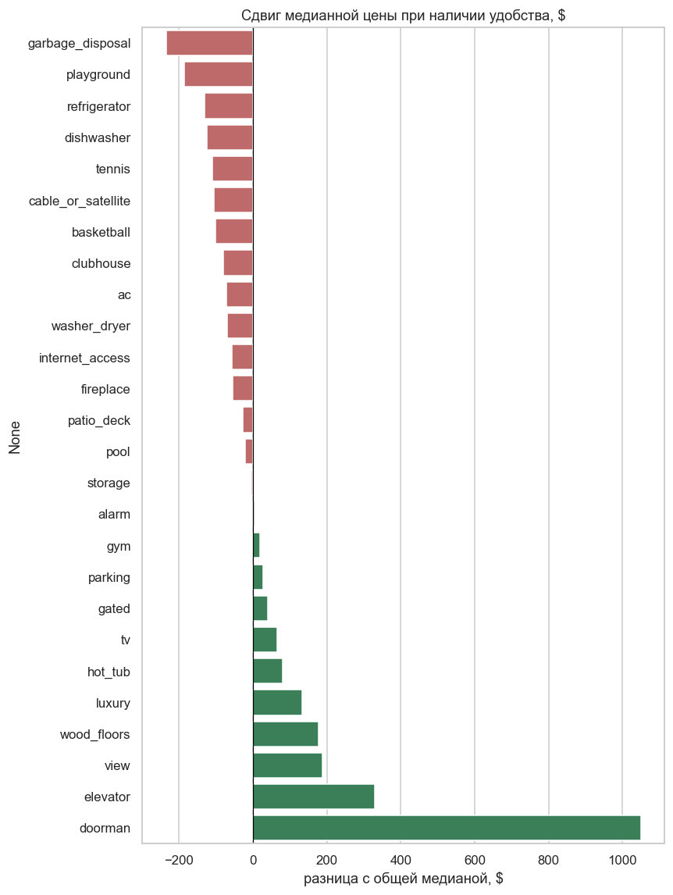

### Утечки таргета

**Первая — колонка `price_display`** Это та же цена, но строкой `$2,195`.
Линейная регрессия с этой колонкой даёт R² = 0.999 и
MAE меньше доллара, без неё — R² = 0.194. Это не «отличная модель», это модель,
которая читает ответ из соседней колонки. Вместе с `price_type` и `currency`
вынес её в список запрещённых колонок, которые удаляются автоматически.

Попутно выяснилось: в 34 объявлениях указан диапазон цены («$1,782 - $1,917»).
Если парсить наивно, выкинув все нецифровые символы, числа склеиваются в
восьмизначные и превращаются в чудовищные выбросы.

**Вторая — цена в тексте объявления** Цена упоминается в теле **48 798
объявлений из 99 492**, почти в половине. Пока из текста берутся только длина и
число слов, это не страшно, но в CP2 я добавлял TF-IDF, и там модель прочитала
бы цену прямо из описания. Поэтому написал функцию, которая вырезает
упоминания цены из текста заранее.

### Сплит

Здесь главная ловушка датасета. Около трети строк — повторные подачи одного
объекта, поэтому при случайном разбиении одна и та же квартира попадает и в
train, и в test.

Проверил это экспериментом: сгруппировал объявления по ключу «координаты +
площадь + спальни + санузлы» и обучил один и тот же KNN при случайном
разбиении и при групповом.

| Сплит | MAE, $ | Общих групп train/test |
|---|---|---|
| наивный случайный | 302.2 | 6 613 |
| групповой | 322.8 | 0 |

Наивный сплит завышает качество примерно на 7%. Дальше везде использую
групповой: объявления об одном объекте целиком уходят в одну выборку.

Пропорции: train 64%, val 16%, test 20%. Валидация нужна отдельно от теста,
чтобы подбирать модель и гиперпараметры, не трогая тест до самого конца.

---

## 4. Baseline-модель

Baseline — точка отсчёта. Без неё непонятно, выиграли мы что-то у разумной
модели или у бессмыслицы.

`DummyRegressor` (предсказывает медиану, не смотрит на признаки вообще), линейную регрессию на пяти исходных числовых колонках и те же
модели на всех сгенерированных признаках.

| Модель | Признаки | MAE, $ | RMSE, $ | MAPE, % | R² |
|---|---|---|---|---|---|
| `dummy_median` | — | 513.7 | 769.5 | 35.6 | −0.041 |
| `linear_regression` | исходные (5) | 485.6 | 681.9 | 36.0 | 0.182 |
| `knn_10` | исходные (5) | **301.2** | 466.4 | 21.0 | 0.618 |
| `linear_regression` | после FE (60) | 322.7 | 488.8 | 22.2 | 0.580 |
| `knn_10` | после FE (60) | 322.8 | 499.4 | 22.9 | 0.562 |

Три вывода:

1. **Линейная модель на сырых признаках почти бесполезна** (R² = 0.18). Связь
   цены с признаками нелинейна, а география не выражается линейной комбинацией
   широты и долготы: цена не растёт монотонно с широтой.
2. **KNN неожиданно силён** Среди пяти признаков два — координаты, и после
   шкалирования KNN фактически ищет географических соседей. «Похожая квартира
   неподалёку стоит столько же» — сильная эвристика.
3. **Feature engineering помог линейной модели и навредил KNN** Это проклятие
   размерности: при 60 признаках вместо 5 евклидово расстояние размывается.

---

## 5. Эксперименты

Сначала сравниваю модели на одинаковых признаках, потом подбираю
признаки на одной модели, и только затем гиперпараметры. Менять всё сразу
нельзя — будет непонятно, что дало прирост.

Тестовая выборка ни в одном эксперименте не участвовала.

### 1. Какая модель лучше

**Гипотеза** Ансамбли деревьев обыграют KNN и линейные модели, потому что
зависимость цены от признаков нелинейна.

**Как проверялось** Одиннадцать моделей на одинаковом наборе признаков
(таблица + target encoding города), один препроцессор, один seed.

**Результат**

| Модель | MAE, $ | RMSE, $ | R² | Обучение, с |
|---|---|---|---|---|
| `extra_trees` | 190.2 | 314.8 | 0.826 | 12.7 |
| `voting_lgbm_xgb_rf` | 192.7 | 308.2 | 0.833 | 24.6 |
| `xgboost` | 193.8 | 308.6 | 0.833 | 1.6 |
| `stacking_lgbm_rf_ridge` | 195.3 | 309.8 | 0.831 | 143.3 |
| `lightgbm` | 196.6 | 309.7 | 0.831 | 4.2 |
| `random_forest` | 201.2 | 325.2 | 0.814 | 19.6 |
| `hist_gb` | 208.6 | 323.6 | 0.816 | 4.0 |
| `catboost` | 217.4 | 340.6 | 0.796 | 2.0 |
| `decision_tree` | 254.7 | 408.7 | 0.706 | 1.1 |
| `ridge` | 268.2 | 412.4 | 0.701 | 0.4 |
| `lasso` | 268.4 | 412.9 | 0.700 | 23.4 |
| `knn_10` | 279.2 | 434.2 | 0.669 | 0.4 |

**Вывод** Гипотеза подтвердилась, разрыв между ансамблями деревьев и линейными
моделями — почти 80 долларов. Ансамбли (Voting, Stacking) не обыграли лучшую
одиночную модель... их базовые модели сильно коррелируют, усреднять почти
одинаковые предсказания бессмысленно, а стекинг при этом обучался 143 секунды
против 13 у ExtraTrees.

### 2. Target encoding города

**Гипотеза** Город — сильнейший фактор цены, его кодирование даст наибольший
прирост.

**Как проверялось** LightGBM с одинаковыми параметрами, отличается только
наличие закодированных `cityname` и `state`. Кодировка — `TargetEncoder` со
схемой cross-fitting для каждой строки статистики считаются без её фолда.
Наивное кодирование средней ценой было бы утечкой.

**Результат**

| Набор | MAE, $ | R² |
|---|---|---|
| без target encoding | 203.0 | 0.817 |
| с target encoding | 196.6 | 0.831 |

**Вывод** Гипотеза не подтвердилась. Прирост всего 6.4 доллара.
Координаты уже передают географию, и деревья режут по ним напрямую.

### 3. Текст объявления

**Гипотеза** В описании есть информация, которой нет в структурных полях
(состояние ремонта, район, тип дома).

**Как проверялось.** TF-IDF (униграммы и биграммы, до 20 000 признаков) со
сжатием до 100 компонент через TruncatedSVD. На вход подаётся очищенный от цен
текст.

**Результат.**

| Набор | MAE, $ | R² |
|---|---|---|
| без текста | 196.6 | 0.831 |
| с текстом | 181.3 | 0.847 |

**Вывод** Подтвердилась, и это самый полезный шаг за всю работу: минус 15.3
доллара.

### 4. Обучение на log(price)

**Гипотеза** Таргет скошен вправо, логарифм уменьшит ошибку.

**Как проверялось** `TransformedTargetRegressor` с `log1p`/`expm1`,
предсказания возвращаются в доллары.

**Результат**

| Таргет | MAE, $ | MAPE, % |
|---|---|---|
| цена как есть | 181.3 | 12.5 |
| log(1 + цена) | 177.6 | 11.7 |

**Вывод** Подтвердилась. По MAE выигрыш скромный, но MAPE упал заметно:
логарифм оптимизирует относительную ошибку, и сильнее всего это помогает
дешёвому жилью.

### 5. Финалисты на лучшем наборе признаков

**Гипотеза** Порядок моделей из Э1 сохранится и после добавления текста.

**Как проверялось** Пять лидеров Э1 переобучены на признаках с текстом и
лог-таргетом.

**Результат**

| Модель | MAE, $ | RMSE, $ | R² | Обучение, с |
|---|---|---|---|---|
| `xgboost` | 172.5 | 293.2 | 0.849 | 18.2 |
| `voting_lgbm_xgb_rf` | 176.3 | 300.1 | 0.842 | 171.6 |
| `extra_trees` | 176.7 | 311.4 | 0.829 | 48.5 |
| `lightgbm` | 177.6 | 297.1 | 0.845 | 19.8 |
| `random_forest` | 192.2 | 326.3 | 0.813 | 166.4 |

**Вывод** Гипотеза не подтвердилась, без текста лидировал
ExtraTrees, с текстом вперёд вышел XGBoost. Причина в том, что сто компонент
SVD — плотные признаки со слабым индивидуальным сигналом, и бустинг набирает из
них качество лучше, чем лес со случайными разбиениями.

Этот эксперимент понадобился именно потому, что в Э1 модели сравнивались без
текста. Выбирать финалиста по устаревшему сравнению было бы ошибкой.

### 6. Снижение размерности

**Гипотеза** KNN просел из-за высокой размерности, сжатие вернёт ему
конкурентоспособность.

**Как проверялось** PCA поверх стандартизации, сетка из 2, 5, 10, 20, 40, 80
компонент, KNN(k=10) на каждой.

**Результат**

| Пространство | MAE, $ | R² |
|---|---|---|
| все 116 признаков | 279.2 | 0.669 |
| PCA, 10 компонент | 274.6 | 0.687 |
| PCA, 20 компонент | 274.7 | 0.686 |
| PCA, 40 компонент | 276.8 | 0.677 |
| PCA, 5 компонент | 338.0 | 0.565 |
| PCA, 2 компоненты | 511.5 | 0.076 |

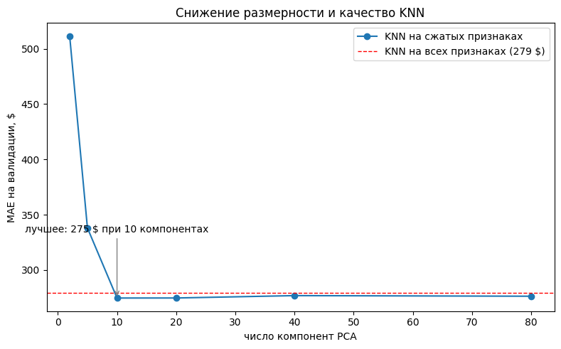

**Вывод** Выигрыш 4.6 доллара, расклад не меняется

Первая версия эксперимента показывала, что 95% дисперсии объясняют 2 компоненты — слишком
красивый результат, чтобы быть правдой. Оказалось, PCA считался на
неотмасштабированных данных... target encoding возвращает цену в долларах с
дисперсией в сотни тысяч, а остальные признаки стандартизованы, и две ценовые
колонки подавили все прочие. После добавления `StandardScaler` перед PCA
выяснилось, что на 95% дисперсии нужно 83 компоненты из 116. Данные почти
не избыточны — поэтому сжатие и не помогает

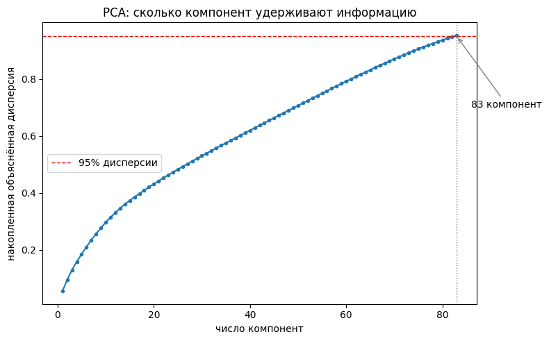

### 7. Подбор гиперпараметров

**Гипотеза** Настройка даст заметный прирост поверх значений по умолчанию.

**Как проверялось** Optuna, по 25 попыток для двух семейств: XGBoost и
ExtraTrees. Оптимизировал MAE на валидации — ту же метрику, по которой потом
выбираю модель. Подбирать по RMSE, а отчитываться по MAE было бы ошибкой:
оптимум у них разный.

**Результат**

| Модель | MAE до подбора, $ | MAE после, $ | Выигрыш |
|---|---|---|---|
| `xgboost` | 172.5 | 161.0 | 11.5 $ |
| `extra_trees` | 176.7 | 175.6 | 1.1 $ |

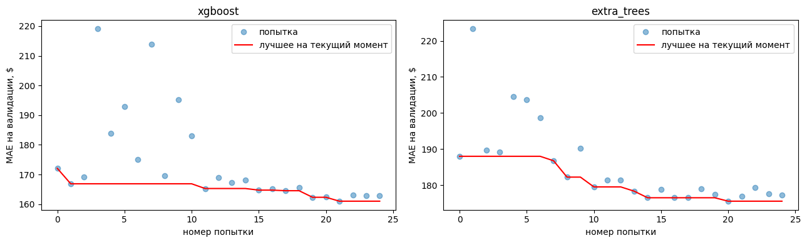

**Вывод** Подтвердилась для бустинга. У ExtraTrees подбор почти ничего не дал...
у случайного леса меньше настраиваемых параметров, и значения по умолчанию уже
близки к оптимуму.

### Сводка гипотез

| # | Гипотеза | Подтвердилась | Эффект |
|---|---|---|---|
| 1 | Бустинг обыграет KNN | да | 279 → 172 $ |
| 2 | Target encoding даст наибольший прирост | нет | 6.4 $ |
| 3 | Текст объявления даст прирост | да, сильнее всего | 15.3 $ |
| 4 | log(price) поможет при перекосе таргета | да | MAPE 12.5% стала 11.7% |
| 5 | Порядок моделей не изменится с текстом | нет | лидер сменился |
| 6 | Снижение размерности вернёт KNN преимущество | почти нет | 4.6 $ |
| 7 | Подбор гиперпараметров даст прирост | да | 11.5 $ |

---

## 6. Финальная модель и интерпретируемость

XGBoost с подобранными гиперпараметрами. Признаки: таблица +
target encoding города и штата + 100 компонент текста. Обучение на `log(price)`.

Параметры: `n_estimators=1200`, `learning_rate=0.032`, `max_depth=10`,
`min_child_weight=13`, `subsample=0.65`, `colsample_bytree=0.74`,
`reg_lambda=0.19`.

Обучал на train + val (79 137 строк). Валидация свою работу отработала при
отборе модели и гиперпараметров, держать её пустой дальше незачем — чем больше
данных, тем лучше финальная модель.

**Результат на тесте** (19 888 строк, которые не использовались ни разу):

| Метрика | Значение |
|---|---|
| MAE | 160.2 $ |
| RMSE | 300.6 $ |
| MAPE | 10.3 % |
| R² | 0.850 |

Против baseline (300.6 $) — улучшение в 1.88 раза.

**Почему именно XGBoost** Лучший MAE среди всех проверенных моделей, лучшие RMSE и
R², то есть он реже допускает крупные промахи, обучается за 18 секунд против 49
у ExtraTrees и 172 у голосующего ансамбля.

### Где модель ошибается

| Сегмент цены | Объявлений | Средняя цена | MAE, $ |
|---|---|---|---|
| до 945 $ | 4 000 | 774.6 | 96.1 |
| 945–1 208 $ | 3 957 | 1 078.6 | 105.7 |
| 1 208–1 475 $ | 4 007 | 1 338.1 | 112.4 |
| 1 475–1 905 $ | 3 955 | 1 668.2 | 151.1 |
| свыше 1 905 $ | 3 969 | 2 666.4 | 336.2 |

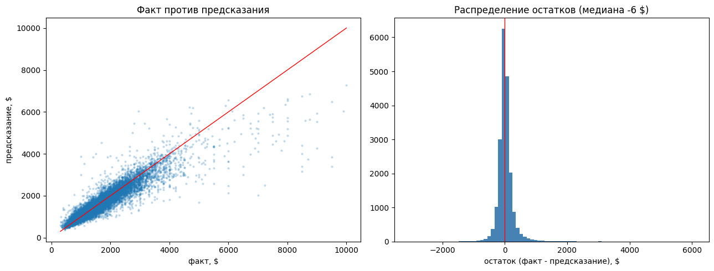

Хуже всего модель работает на дорогом сегменте MAE 336 $ против 96 $ на
дешёвом. В относительных величинах разрыв гораздо меньше (12.6% против 12.4%),
то есть модель ошибается пропорционально цене, а не систематически хуже.
Дорогое жильё разнороднее... там на цену влияют вид из окна, этаж, отделка —
того, чего в данных просто нет.

### Интерпретируемость

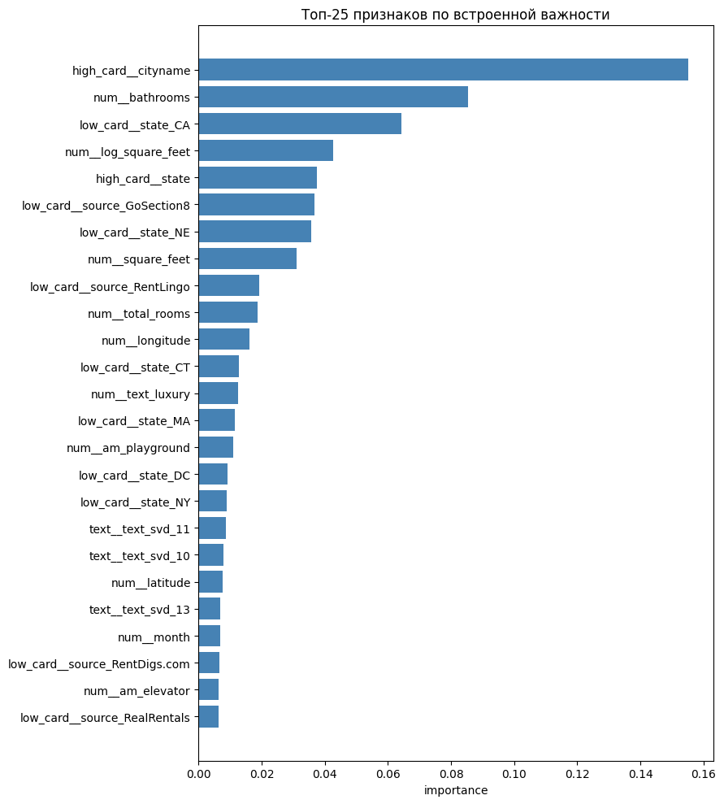

Топ признаков
- город (15.5%)
- число санузлов (8.5%)
- штат Калифорния (6.4%),
- логарифм площади (4.3%)

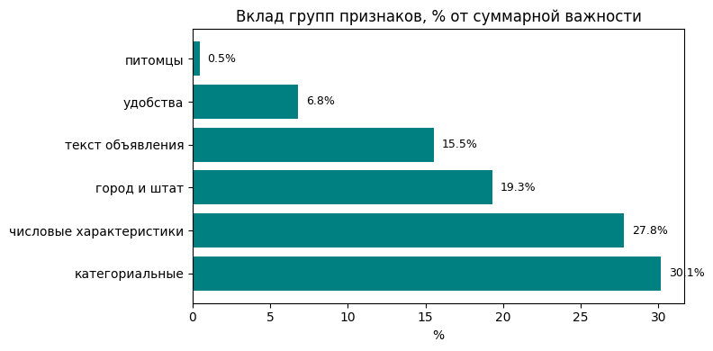

- категориальные признаки 30.1%
- числовые характеристики 27.8%
- город
- штат 19.3%
- текст 15.5%
- удобства 6.8%

Картина осмысленная и совпадает со здравым смыслом... важнее всего где квартира,
потом её размер, потом что написано в объявлении. Я смотрел на этот список не
только ради отчёта — если бы в топе оказалось что-то неожиданное, это был бы
первый признак утечки, и проверять такое надо до выкатки, а не после.

---

## 7. Деплой

API для программных запросов (обязательная часть) и
веб-интерфейс, чтобы моделью можно было пользоваться руками.

### API на FastAPI

Пять эндпоинтов:

| Метод | Путь | Назначение |
|---|---|---|
| GET | `/health` | сервис жив, модель загружена |
| GET | `/model-info` | тип модели, метрики, число признаков |
| GET | `/cities` | поиск города по подстроке, для подсказок |
| POST | `/predict` | предсказание по одному объявлению |
| POST | `/predict/batch` | до 100 объявлений за раз |

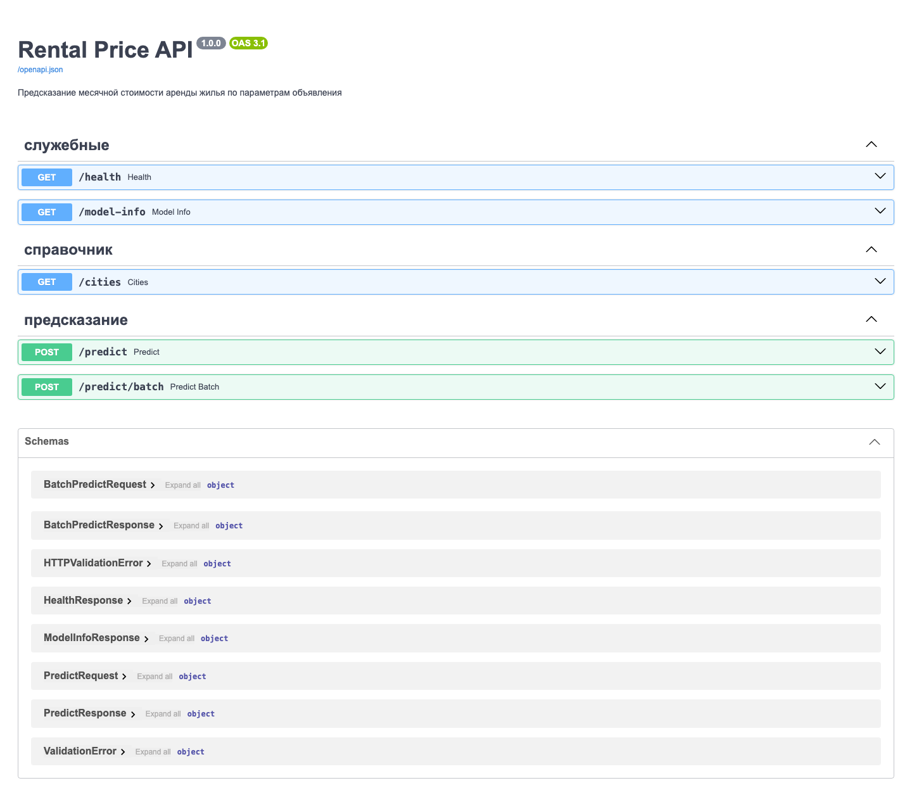

Запрос и ответ:

```bash
curl -X POST http://localhost:8000/predict \
  -H "Content-Type: application/json" \
  -d '{"square_feet": 850, "bedrooms": 2, "bathrooms": 1,
       "cityname": "Austin", "amenities": ["Parking", "Pool"],
       "body": "Renovated apartment close to downtown."}'
```

```json
{
  "predicted_price": 922.34,
  "price_range": [762.14, 1082.54],
  "city_median": 1100.0,
  "comment": "Город известен модели"
}
```

Кроме самой цены возвращаю интервал ± MAE модели и медианную цену по городу:
одно число без контекста мало что говорит пользователю.

Валидацию сделал на pydantic, причём границы взял те же, что при очистке
данных (площадь 100–6000 кв. футов). Модель не видела значений за их пределами,
и выдавать предсказание на таких данных нечестно.

**Отдельная проблема, с которой пришлось разбираться** При обучении признак
`city_listing_count` считался по всему датасету. В API приходит одна строка, и
по ней такое не посчитать — признак всегда был бы равен единице, а модель
обучалась на реальных частотах. Поэтому сохранён справочник городов
(частоты, координаты, медианные цены) рядом с моделью и подставляю значения
оттуда. Заодно это позволило не спрашивать у пользователя широту и долготу.

### Интерфейс на Streamlit


Форма с параметрами квартиры, результат с интервалом и сравнением с медианой по
городу. Если API недоступен, интерфейс считает напрямую моделью — так его можно
показать и без запущенного сервера.

### Запуск

Всё поднимается командой:

```bash
docker compose up api ui
```

API будет на `http://localhost:8000/docs`, интерфейс — на
`http://localhost:8501`. Интерфейс ходит в API по имени сервиса внутри сети
compose.

---

## 8. Заключение и выводы

**Что получилось** Модель предсказывает месячную аренду с ошибкой 160 долларов
при средней цене 1500, то есть примерно 10% относительной ошибки. Это в 1.88
раза лучше baseline. Работает как API и как веб-интерфейс, всё запускается
через Docker.

**Что можно улучшить** Дорогой сегмент предсказывается заметно хуже — можно
обучить для него отдельную модель или добавить признаки, которых сейчас нет
(этаж, год постройки, расстояние до центра города). Ещё полезно было бы
добавить оценку неопределённости: сейчас интервал считается просто как ± MAE
модели, хотя для разных объявлений уверенность разная.

---

## Приложение

```bash
make install
make data
make baseline
make experiments
make test
docker compose up api ui
```